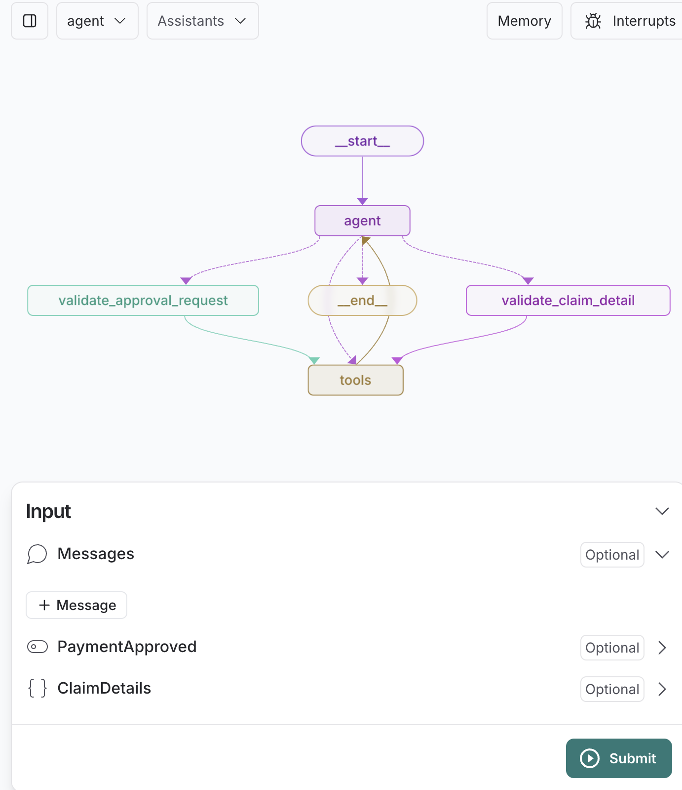

# ClaimProcessor Agent Using LangGraph 

The core logic is defined in `src/agent/graph.ts` and the api packaging the agent is served from `src/app.ts`


The graph can be viewed in the [LangGraph studio UI](https://studio.langgraph.com/)




### Running the application

```
 npm run build
 node dist/src/app.js
```

### Testing the application

```
curl -X GET "http://localhost:3000/api/chat?message=I+would+like+to+submit+a+claim%2C+my+details+are+as+below%3A+name%3A+Joe+Blog+insurance+type%3A+car+address%3A+300+Pramatta+Road%2C+Sydney+2000+amount%3A+5000+description%3A+I+had+a+car+accident+under+no+fault+email%3A+user%40email.test+policyNumber%3A+1122323232+When+my+application+is+completed%2C+please+write+a+satire+for+me."
```

response from the agent:

```
{"message":"Your claim has been successfully submitted and approved. Here is a satire for you:\n\n---\n\nIn the land of insurance woes, where accidents strike without a cause,\nJoe Blog stood tall, with a claim so true, a car mishap he did rue.\n\nOn Pramatta Road, in Sydney's heart, his car met fate, torn apart,\nNo fault of his, the truth be told, yet the damages took their toll.\n\nWith claim in hand, and approval bright, Joe's journey now sees the light,\nThe insurance gods have smiled on him, his claim approved, to the brim.\n\nSo here's to Joe, a tale well spun, of car mishaps and battles won,\nMay his wheels roll smooth, his path be clear, in the world of claims, no fear.\n\n---\n\nIf you need any further assistance or have any more claims to submit, feel free to let me know!"}
```
