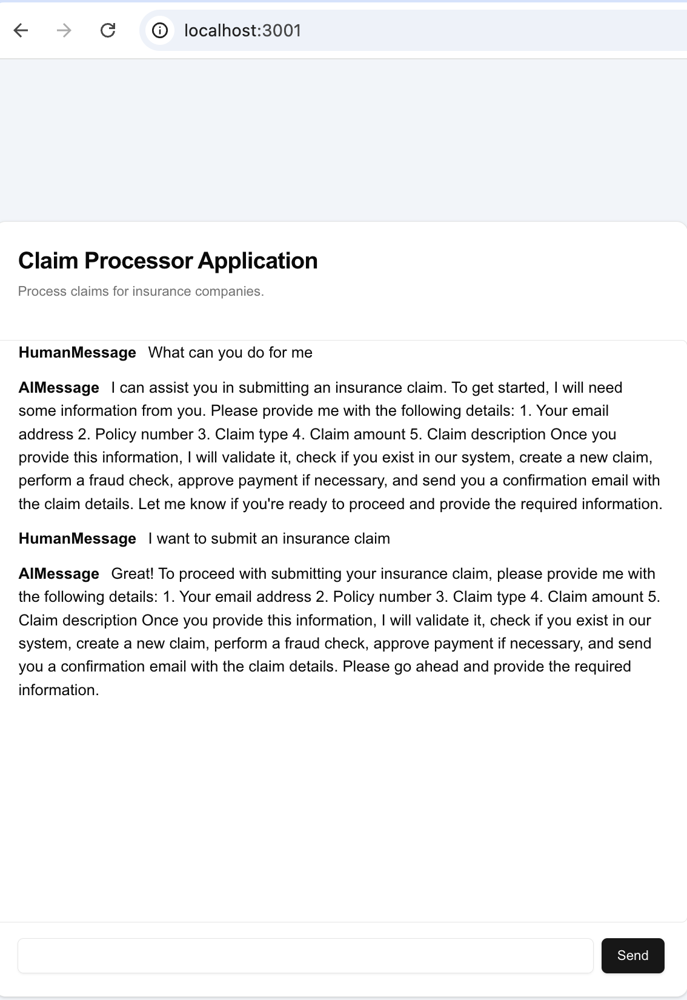

# Claim Processor App

UI interface for the LangGraph Agent API built in this repo https://github.com/achalise/llm-experiments/tree/main/claim-processor-agent 

## Running the App

First ensure the api is running by following [instructions](https://github.com/achalise/llm-experiments/tree/main/claim-processor-agent)  

Then, run the development server:

```bash
npm run dev
# or
yarn dev
# or
pnpm dev
# or
bun dev
```
This will start a development server at `http://localhost:3001` with hot module reloading enabled.

Open [http://localhost:3001](http://localhost:3001) to access the app.


